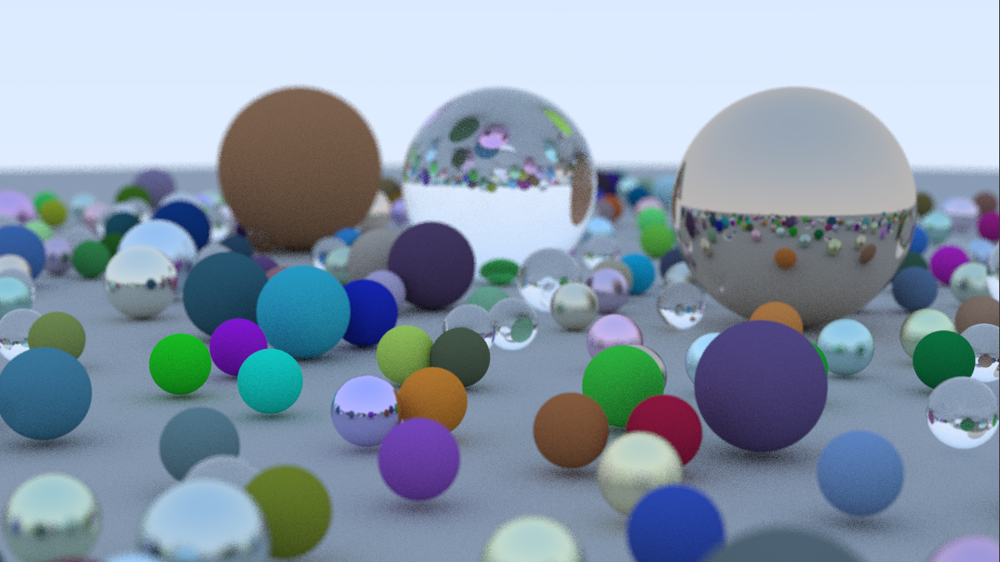

# PPM Raytracer

Welcome to my sophisticated raytracer project! This project represents my journey in computer graphics, where I developed a powerful raytracer from scratch in C++ to create realistic 3D renderings.

## Project Highlights

- ⚙️ **Multithreaded Rendering Performance:** As an independent project, I took the initiative to optimize the raytracer's rendering performance. I achieved efficient rendering times while maintaining high-quality output by implementing multithreading to the core raytracer.

- 🌐 **Realistic 3D Renderings:** I built this raytracer with a focus on creating stunning 3D renderings that include shading, lighting, and shadows.

- ✨ **Ray-Sphere Intersection:** The raytracer includes sophisticated ray-sphere intersection algorithms, which are fundamental to achieving realistic rendering.

- 🔮 **Reflection and Refraction:** I implemented reflection and refraction techniques to further enhance the visual realism of the rendered scenes.

- 🧩 **Modular and Extensible Design:** I followed object-oriented design principles to create a modular and extensible codebase. This design enables easy addition of new features and rendering objects beyond spheres. It ensures that the raytracer can evolve to handle more complex scenes and geometries.

## Examples

Here are some sample renderings created using this raytracer:

### Width: 1200px, Samples Per Pixel: 50

## Acknowledgments

I would like to acknowledge the invaluable resources, tutorials, and the computer graphics community for inspiring and guiding me throughout this project.
- https://raytracing.github.io/ has been an invaluable source throughout my journey in learning computer graphics. This project was started by following the tutorials in this series of books, and over time, I have made my own contributions and evolved the project into my own.

## Contact

If you have any questions, suggestions, or would like to collaborate on further development, please feel free to contact me:

- GitHub: [owen-west](https://github.com/owen-west)
